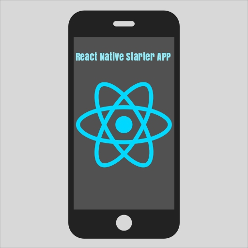

 

This project provides a reference when building out RN apps. The application uses the following:

- MVC
- Mobx for state management
- Reusable components

Requirements:

- npm: 6.4.1
- react-native-cli: 2.0.1
- react-native: 0.58.5